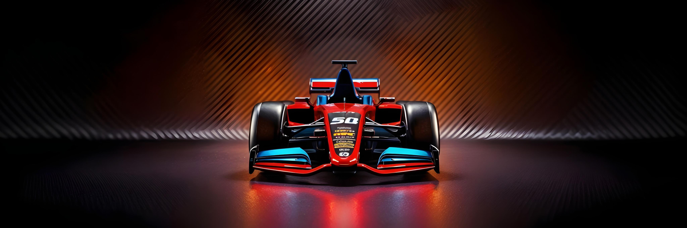

# F1 NFT Card Packs

A decentralized application (dApp) for minting and collecting animated NFT cards featuring Formula 1 car parts. Built on a robust Ethereum-based smart contract using the ERC-1155 standard and an interactive Next.js frontend, this project seamlessly merges blockchain technology with modern web development.

> 🚀 **[Live Demo](https://f1-card-packs-nft.vercel.app/)**

 

## 🛠️ Tech Stack

**Blockchain & Smart Contracts:**

- **Ethereum (Sepolia Testnet):** Secure, widely-used blockchain network.
- **Solidity:** Smart contract programming language.
- **Hardhat:** Smart contract development and deployment framework.
- **Alchemy:** Blockchain infrastructure for contract deployment and network interaction.
- **Pinata (IPFS):** Decentralized storage for NFT assets and metadata.

**Frontend Development:**

- **Next.js:** React framework with server-side rendering for optimized performance.
- **Tailwind CSS:** Utility-first CSS framework for responsive design.
- **Ethers.js:** Web3 integration for wallet connection and smart contract interactions.
- **Vercel:** Deployment platform for seamless CI/CD.

 

## 🔑 Key Features

- **Decentralized Asset Storage:** NFT metadata and assets hosted on IPFS via Pinata.
- **Random NFT Distribution:** Pseudo-random logic ensures unpredictable pack contents.
- **Responsive UI:** Built with Tailwind CSS for optimal user experience across devices.
- **Secure Transactions:** Ethers.js integration guarantees secure wallet interactions.

 

## 🎥 Preview

https://github.com/user-attachments/assets/f6a4a29a-57eb-43ad-81e1-d9b3d7b17946

 

### 🎨 NFT Card Designs

|  #1 |  #2 |  #3 |
|--|--|--|

 

## 🔮 Future Improvements

- **Chainlink VRF:** Implement true randomness for NFT distribution.
- **Mainnet Deployment:** Transition from testnet to Ethereum mainnet.
- **Secondary Market Integration:** Enable direct resale of NFTs through integrated marketplaces.
- **Enhanced Animations:** Introduce more dynamic and interactive NFT designs.

 

---

*Crafted with passion for blockchain technology and web development.*
